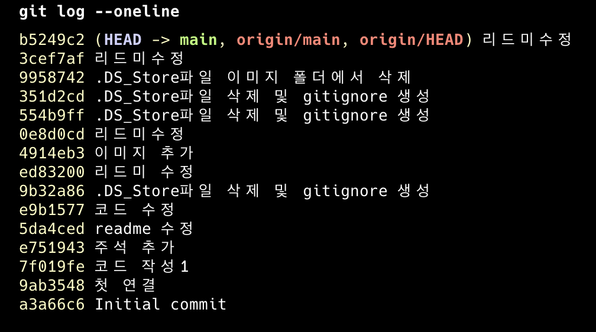
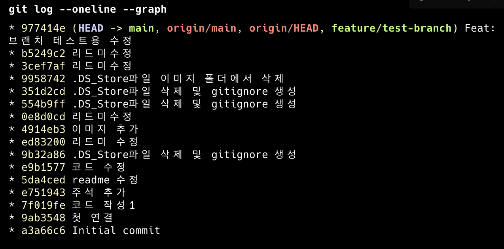

<!-- @format -->

# 콘솔에서 실행되는 퀴즈 게임 만들기

1. 개요
   Python을 이용하여 콘솔 환경에서 실행되는 퀴즈 게임을 구현하였습니다. 퀴즈를 풀고, 문제를 추가할 수 있으며 점수를 확인할 수 있습니다. 프로그램을 종료해도 JSON 파일에 문제들을 저장하여 영구적으로 사용할 수 있습니다.

2. 실행 환경

- OS: macOS
- Python: 3.13.2
- 개발 도구: Visual Studio Code, Terminal

3. 수행 리스트

- [✔] 프로그램 실행됨 (`python main.py`)</br>
- [✔] 메뉴 정상 출력</br>
- [✔] 퀴즈 풀기 가능</br>
- [✔] 퀴즈 추가 가능</br>
- [✔] 점수 저장됨</br>
- [✔] 종료</br>
- [✔] state.json 생성됨</br>
- [✔] 스크린샷 4개 있음</br>
- [✔] GitHub 업로드 완료</br>

4. 디렉토리 구조
   quiz_game_python/</br>
   └── img/</br>
   └── main.py/</br>
   └── quiz.py/</br>
   └── quiz_game.py/</br>

5. 실행 방법

```python
python3 main.py
```

6. 수행 결과

   1. 메뉴 화면
      

   2. 퀴퀴즈 진행
      

   3. 퀴즈 추가
      
      

   4. 점수 확인
      
      
      

   5. 문제 목록 출력
      

   6. 종료
      

   7. state.json 생성됨
      
      

   8. GitHub 업로드 완료
      
      

7. 입력 오류 처리
   프로그램은 다음과 같은 입력 오류를 처리하도록 구현하였습니다.

   - 공백 입력 → 재입력 요청
   - 문자 입력 → 숫자로 입력하라는 안내 메시지 출력
   - 범위 밖 숫자 → 올바른 범위 안내 후 재입력
   - Ctrl + C → 프로그램 안전 종료

   👉 관련 코드: `get_int_input()` 함수

   ```python
   if user_input == "":
       print("빈 입력은 허용되지 않습니다.")
   ```

   ```python
   except ValueError:
       print("숫자로 입력해야 합니다.")
   ```

8. 기본 퀴즈 5개 이상 포함

   기본 퀴즈는 총 6개 이상 포함되어 있으며,
   프로그램 실행 시 자동으로 로드됩니다.

   👉 관련 코드: `get_default_quizzes()`

   또한 아래 화면에서 확인할 수 있습니다.

   

   ***

9. Git 커밋 내역

   총 10개 이상의 의미 있는 커밋을 수행하였습니다.

   ```bash
   git log --oneline
   ```

   

10. 브랜치 및 병합
    브랜치를 생성하여 기능 개발 후 main 브랜치에 병합하였습니다.

    ```bash
    git checkout -b feature/quiz-play
    git merge feature/quiz-play
    ```

    

11. clone / pull 실습

프로젝트 완료 후 다음 과정을 수행하였습니다.

1.  저장소 clone
2.  파일 수정 후 push
3.  기존 디렉토리에서 pull 수행

```bash
git clone https://github.com/L-jy16/quiz_game_python
git pull
```
