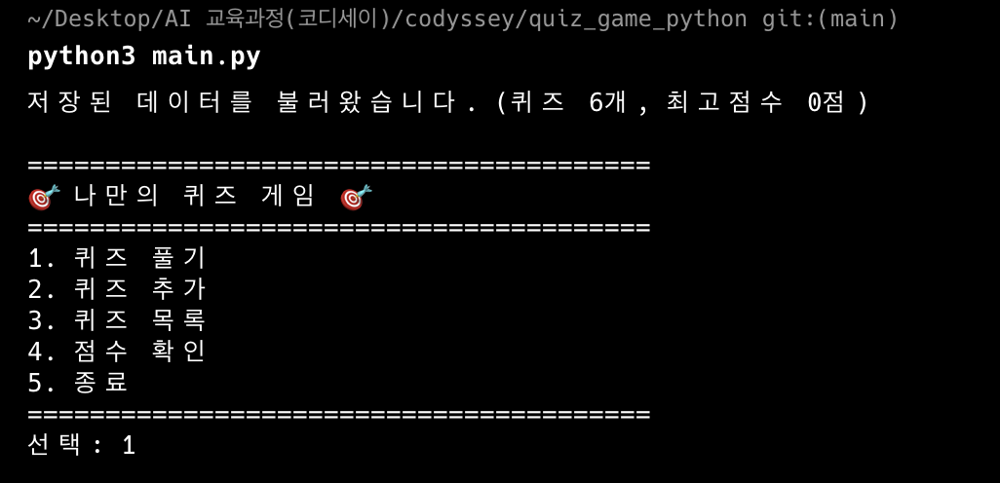
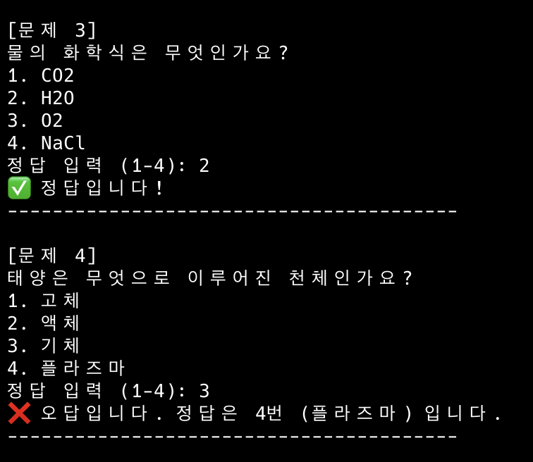
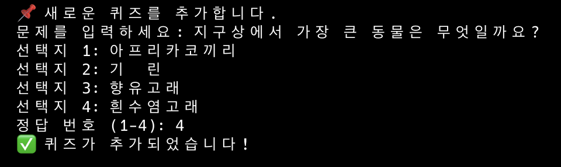
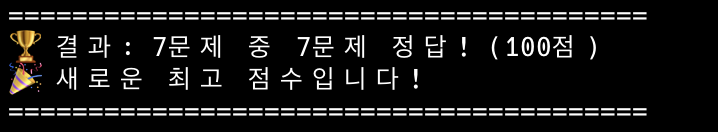
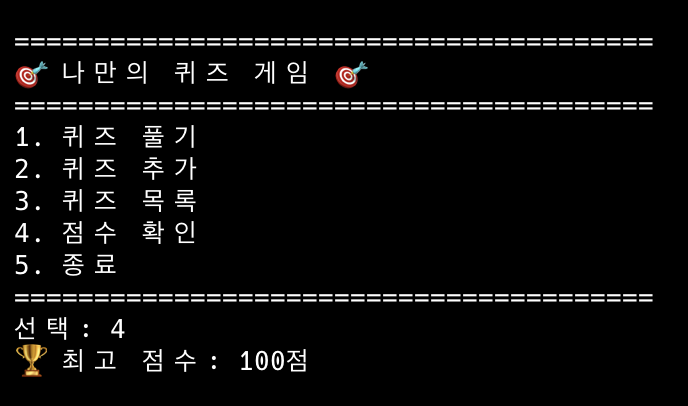
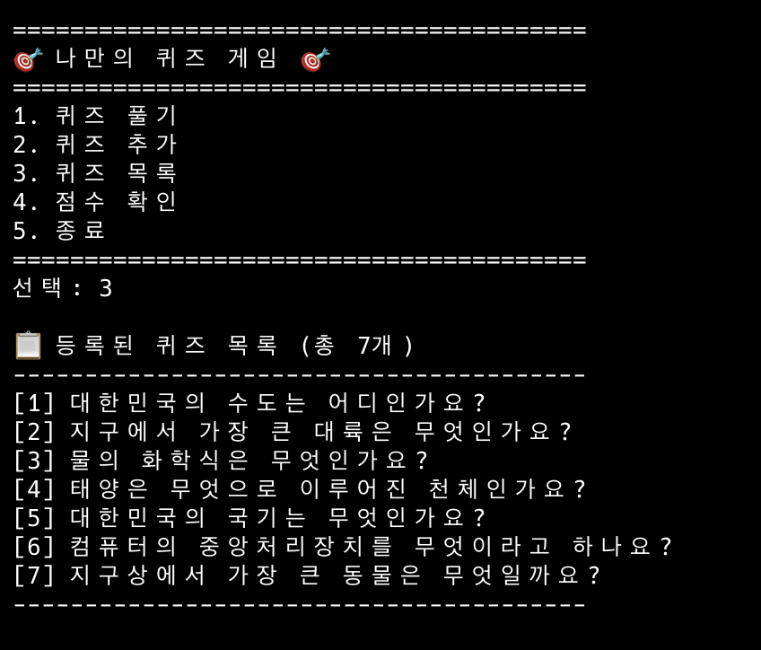
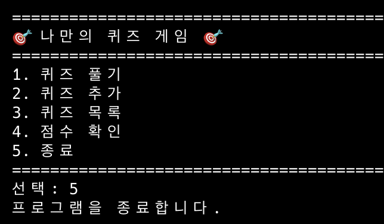
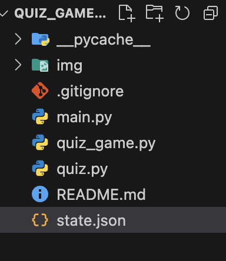
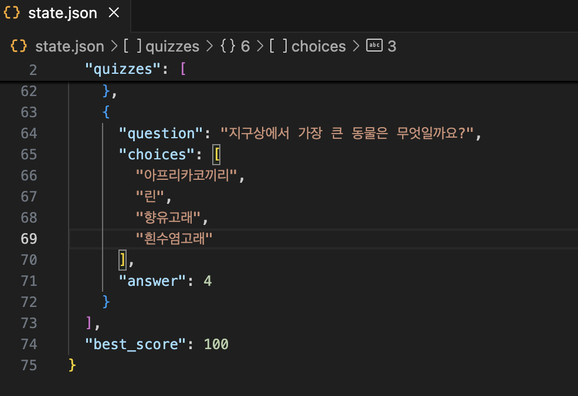
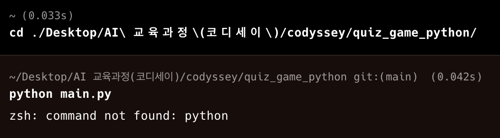

<!-- @format -->

# 콘솔에서 실행되는 퀴즈 게임 만들기

1. 개요
   Python을 이용하여 콘솔 환경에서 실행되는 퀴즈 게임을 구현하였습니다. 퀴즈를 풀고, 문제를 추가할 수 있으며 점수를 확인할 수 있습니다. 프로그램을 종료해도 JSON 파일에 문제들을 저장하여 영구적으로 사용할 수 있습니다.

2. 실행 환경

- OS: macOS
- Python: 3.13.2
- 개발 도구: Visual Studio Code, Terminal

3. 수행 리스트

- [✔] 프로그램 실행됨 (`python main.py`) 
- [✔] 메뉴 정상 출력 
- [✔] 퀴즈 풀기 가능 
- [✔] 퀴즈 추가 가능 
- [✔] 점수 저장됨 
- [✔] 종료 
- [✔] state.json 생성됨 
- [✔] 스크린샷 4개 있음 
- [✔] GitHub 업로드 완료 

4. 디렉토리 구조
   quiz_game_python/
   └── img/
   └── main.py/
   └── quiz.py/
   └── quiz_game.py/

5. 수행 결과

   1. 메뉴 정상 출력
      

   2. 퀴즈 풀기 가능
      

   3. 퀴즈 추가 가능
      
      

   4. 점수 저장됨
      
      
      

   5. 문제 목록 출력
      

   6. 종료
      

   7. state.json 생성됨
      
      

   8. GitHub 업로드 완료
      
      
